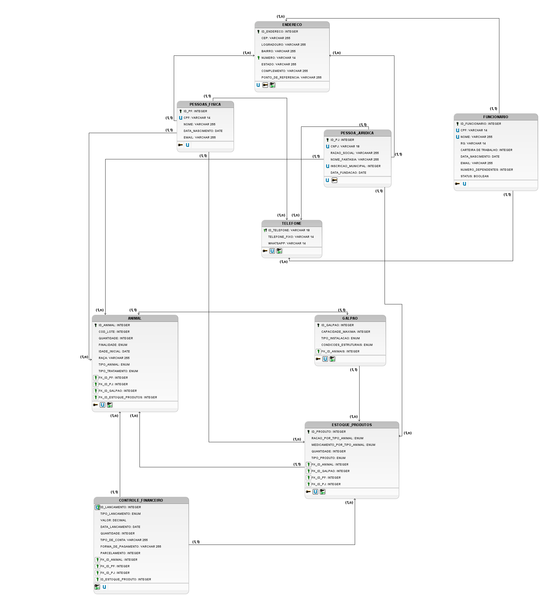

# 🐾 SISTEMA DE GESTÃO PARA TRATAMENTO E VENDA DE ANIMAIS

## 🚀 Visão Geral do Projeto

Este projeto consiste na Etapa II de um Projeto Prático de Banco de Dados, focado na criação de um Sistema de Gestão (ERP) para uma clínica ou empresa que realiza o **tratamento e a venda de animais**.

O sistema foi modelado para gerenciar informações cruciais sobre animais, estoque de produtos, controle financeiro, funcionários e a estrutura física da empresa (galpões), além de lidar com os diferentes tipos de entidades (Pessoa Física e Jurídica) que interagem com o negócio.

---

## 👥 Alunos

* **Davi Bezerra Marques**
* **Raimundo Avelino**

---

## 🌳 Estrutura do Repositório

## 📁 Estrutura de Pastas

```
projeto/
│
├── assets/
│   ├── MODELO_LOGICO.png
│
├── entidade_relacionamento/
│   ├── animal_estoque_produto.sql
│
├── entidade_principais/
│   ├── animal.sql
│   ├── controle_financeiro.sql
│   ├── endereco.sql
│   ├── estoque_produto.sql
│   ├── funcionario.sql
│   ├── galpao.sql
│   ├── pessoa_fisica.sql
│   ├── pessoa_juridica.sql
│   ├── pessoa.sql
│   ├── telefone.sql
│
│
├── Makefile
└── README.md
```

A organização dos arquivos reflete as diferentes etapas de criação e manipulação do banco de dados:

| Arquivo/Diretório | Descrição |
| :--- | :--- |
| `erp.sql` | **Script principal** de criação do banco de dados e definição de todas as tabelas (DDL). |
| `entidades_principais/` | Scripts de inserção (DML) para popular as tabelas principais, como `animal`, `funcionario`, `pessoa`, `estoque_produto`, etc. |
| `entidade_relacionamento/` | Scripts de inserção (DML) focados nas tabelas de relacionamento, como `animal_estoque_produto`. |
| `consultas.sql` | Contém exemplos de consultas (SELECTs) e comandos SQL testados para validação da estrutura do banco. |
| `README.md` | Este arquivo, contendo a documentação e visão geral do projeto. |

---

## 💻 Ferramentas e Tecnologias

* **BD:** _[PostgreSQL]_
* **SGBD:** _[PGAdmin]_
* **Geração de Dados:** O **ChatGPT** foi utilizado como ferramenta auxiliar para a geração em massa dos scripts de inserção de dados (DML), garantindo um volume de dados para testes.

---

## 🗺️ Diagrama (Modelo Entidade-Relacionamento)

Abaixo está o **Diagrama Entidade-Relacionamento (DER)** que representa a estrutura lógica do banco de dados. Este diagrama detalha as entidades, seus atributos e os relacionamentos definidos no projeto.


## 🗺️ Diagrama (Modelo Lógico)

